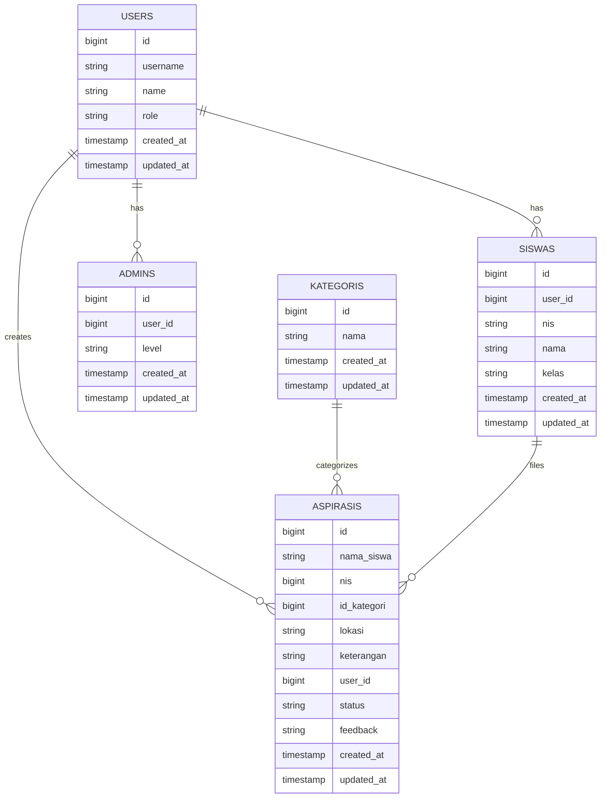

```mermaid
erDiagram

    USERS {
        bigint id
        string username
        string name
        string role
        timestamp created_at
        timestamp updated_at
    }

    SISWAS {
        bigint id
        bigint user_id
        string nis
        string nama
        string kelas
        timestamp created_at
        timestamp updated_at
    }

    ADMINS {
        bigint id
        bigint user_id
        string level
        timestamp created_at
        timestamp updated_at
    }

    KATEGORIS {
        bigint id
        string nama
        timestamp created_at
        timestamp updated_at
    }

    ASPIRASIS {
        bigint id
        string nama_siswa
        bigint nis
        bigint id_kategori
        string lokasi
        string keterangan
        bigint user_id
        string status
        string feedback
        timestamp created_at
        timestamp updated_at
    }

    USERS ||--o{ SISWAS : has
    USERS ||--o{ ADMINS : has
    USERS ||--o{ ASPIRASIS : creates
    KATEGORIS ||--o{ ASPIRASIS : categorizes
    SISWAS ||--o{ ASPIRASIS : files
```
